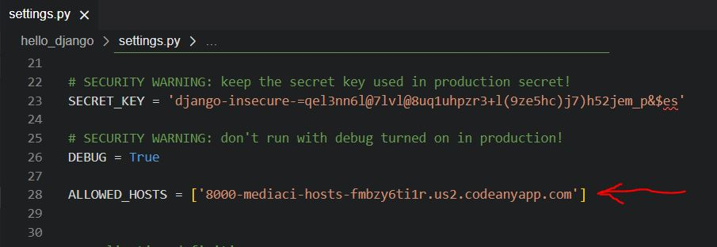

# TechStore

## These are the steps i took to create this project
## You are welcome to use this project as you please

### 1 - Open Git hub and then open repositories then click the green create button on the top right then by repositories name name your project then scroll down and click create repository

### 2 - Then click the open in gitpod green button

#### In git pod

### 3 - When gitpod open type this in your terminal pip3 install 'django<4'

### 4- Then type this in your terminal pip3 install django-allauth==0.41.0

### 5 - Then type this in your terminal django-admin startproject YOUR PROJECT NAME .

## 6 - Create a basic gitignore file by typing touch .gitignore then in gitignore file add these *.sqlite3 *.pyc __pycache__

### 6 - Then type this in your terminal python3 manage.py runserver your projext should open

### 7 - Then go to settings.py in your project folder '8000-donnavanstadd-techstore-5hxkhqpe0wb.ws-eu105.gitpod.io'

Inline-style: 

### 8 - Stop server by pressing ctrl and c at the same time

### 9 - The run initioal mogrations by typing python3 manage.py migrate

### 10 - Create superuser to lgin to admin by typing python3 manage.py createsuperuser

### 11 - then create username the hit enter, then enter email then hit enter, the password